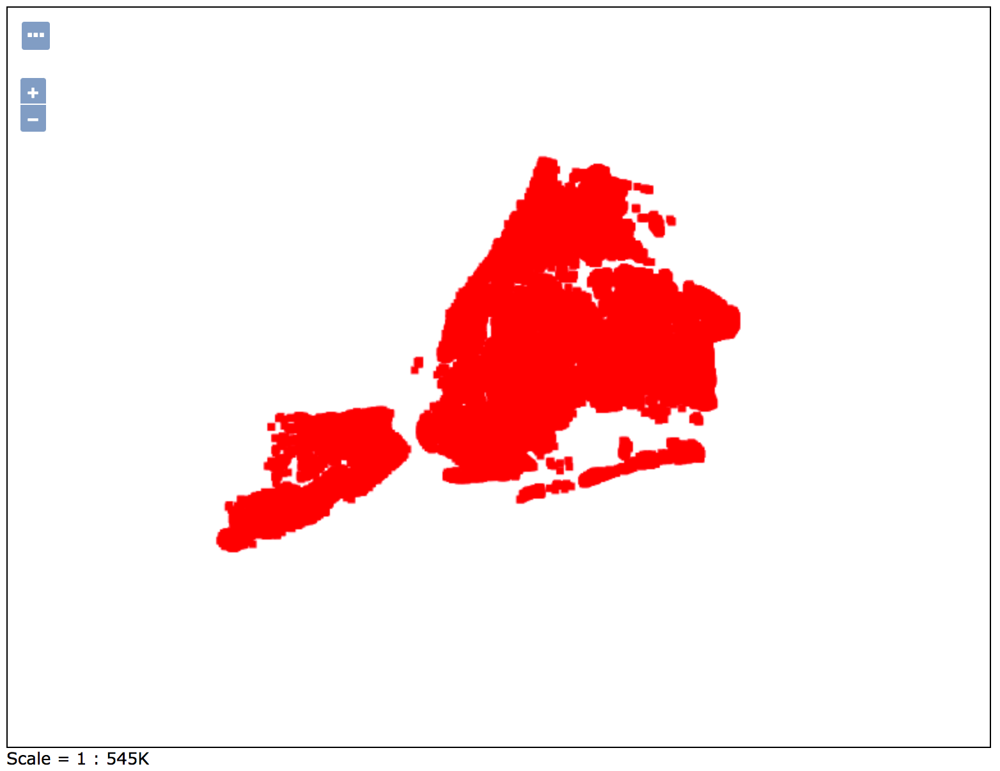
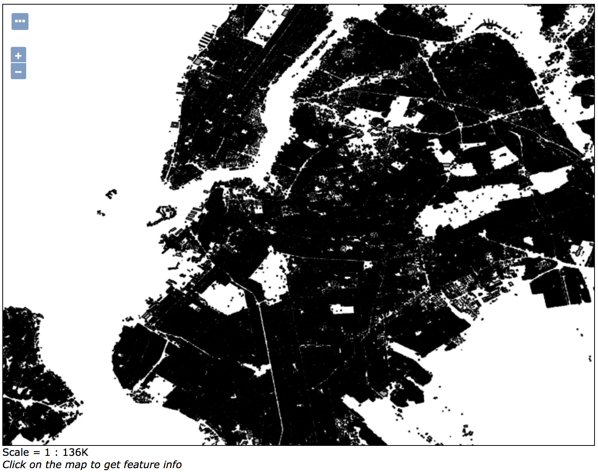

# GeoStack
This is the geostack implementation supporting the mapathon. 

This repo has three containers in it. 

* Geoserver docker container
* Postgis docker container 
* Mongo docker container [not currently used]

Currently the compose file only has references to the Geoserver and Postgis containers. 

## Data Sets
There is a data directory where the data currently lives called 'shared-data'.  This directory contains all of the data gathered to support the client project that was being worked on. The compose file expects the zip file in the shared-data directory to be copied into a directory named: ./data/pg/data/shp and then expanded. 

[Urban Layers](https://morphocode.com/making-urban-layers/) was the inspiration for standing this stack up and getting it going.  There are other ideas that are being considered in conjunction with this dataset. 

Along with these data sets: 

* [Building Footprints](https://data.cityofnewyork.us/Housing-Development/Building-Footprints/nqwf-w8eh) 
* [The Pluto DataSet](https://www1.nyc.gov/site/planning/data-maps/open-data/dwn-pluto-mappluto.page#mappluto)

In order to get started with this project create a .env file in the same directory as this README.md file and put the following line in it with the password for the postgres user: 

DB_PASSWORD=<my super secret wordpass>

Now provided docker is installed on your pc you are ready to run docker-compose up to bring up the services and begin using them. 

When the services come up they are not connected they are just the geoserver and the postgis services that still need to be configured and connected.  

The default user and password for geoserver is admin and geoserver. 
The password for the postgres user is whatever you input into the .env file. 

Now run 'docker-compose up' and you should be the proud owner of two new geo services.  
* To access your local [geoserver](http://localhost:8080/geoserver) it should be localhost and port 8080 unless the compose file was modified for your configuraion.  * To access postgis it will be available at localhost:5432  

## Loading Data

Now log into the postgis container using the command 
docker exex -it <container-id> /bin/bash and cd to the following directory: 

shp2pgsql -s 4326 geo_export_7f607ec8-a29e-4672-808d-f6a04d6fd5ab | psql -d template_postgis -U postgres

shp2pgsql -s 4326 geo_export_2e45fdc5-85c1-416c-aeeb-a1856c52c5c1 | psql -d template_postgis -U postgres 

These commands will put two tables in the postgress database one full of point data and one full of polygon data.  

## Configure Services and Expose Layers

Now we need to configure the services and expose the data as layers that can be accessible from other programs. 

1. First login to geoserver using the default username and password. 
2. Go to Workspaces (under the data heading) and create a new workspace named "nyc".
3. Go to stores and create a new postgis datastore. The most important settings are host: 1904-postgis and port: 5432 and the user: postgres and the password is what you chose for the .env file above. 
4. Go to layers and add two layers that map to the tables created in the shp2pgsql commands above. 
5. Please note you should be able to use most of the default settings you will have to ask geoserver to calculate the bounds of the data. 

## Layer Preview
Now you can go to layer preview and select the geojson formats to get the data url for rendering in your mapping client.  Whether that is an ol-kit app, a QGis Client, or something else.  Or alternatively you can go to the openlayers preview and get a rendered view of your data set which should look like the following: 

### Point Data 

### Polygon Data

